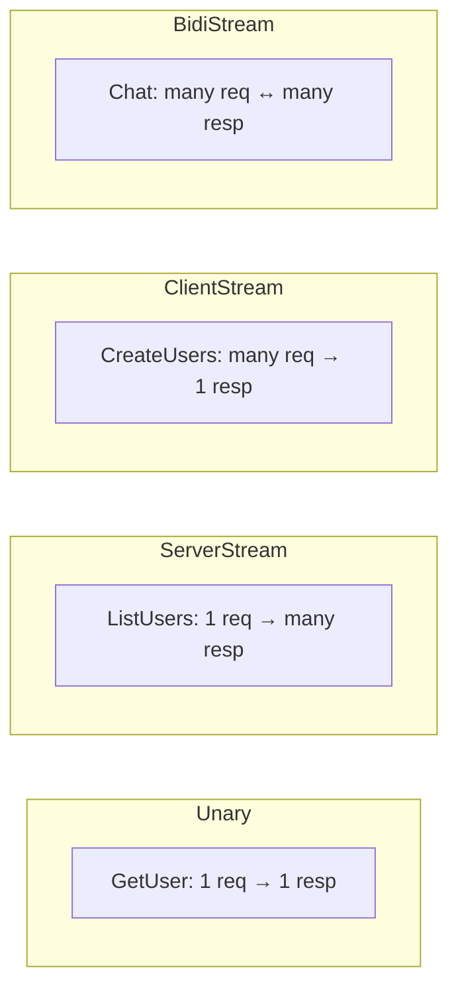
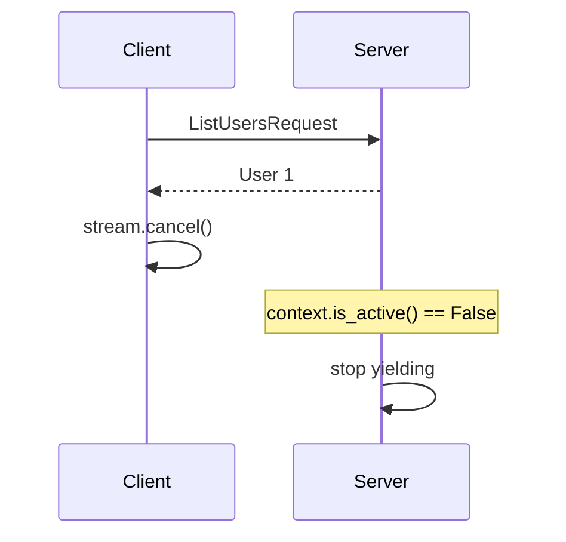
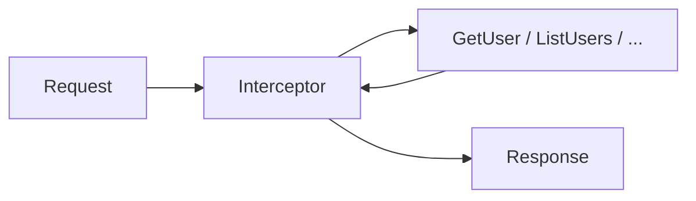
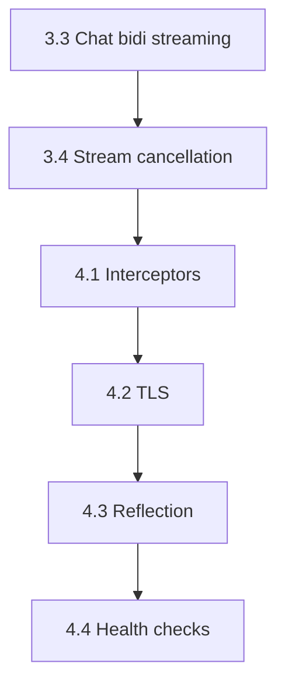

# gRPC Self-Guided Plan: Steps 3.3 → 4.4

Save this as your reference while you implement. **You write the code** — ask the assistant to explain or review, not to implement.

---

## Where you are now


| Done                                                 | Pending                  |
| ---------------------------------------------------- | ------------------------ |
| Phase 1: Unary `GetUser`                             | 3.3 Bidirectional `Chat` |
| Phase 2: bytes, framing, metadata, errors, deadlines | 3.4 Stream cancellation  |
| 3.1 `ListUsers` (server streaming)                   | 4.1 Interceptors         |
| 3.2 `CreateUsers` (client streaming)                 | 4.2 TLS                  |
|                                                      | 4.3 Reflection           |
|                                                      | 4.4 Health checks        |


**Your current files:**

- `[protos/user.proto](protos/user.proto)` — `ChatMessage` started but incomplete (line 23–25); no `Chat` RPC yet
- `[server.py](server.py)` — has `GetUser`, `ListUsers`, `CreateUsers`; no Chat, interceptors, TLS, health, reflection
- `[client.py](client.py)` — tests 1–5 only
- `[requirement.txt](requirement.txt)` — missing `grpcio-reflection` and `grpcio-health-checking` (add when you reach Phase 4)

**Port note:** You use `PORT = 50051`. If `fuser 50051/tcp` shows stuck processes with **Permission denied** on kill, switch both files to `50052` or reboot — see `[README.md](README.md)` troubleshooting.

---

## Big picture: all 4 RPC patterns




| Step    | RPC           | Client sends       | Server sends         | Generated stub      |
| ------- | ------------- | ------------------ | -------------------- | ------------------- |
| 3.1     | `ListUsers`   | 1                  | many (`yield`)       | `unary_stream`      |
| 3.2     | `CreateUsers` | many (`yield`)     | 1 (`return`)         | `stream_unary`      |
| **3.3** | `**Chat`**    | **many (`yield`)** | **many (`yield`)**   | `**stream_stream`** |
| 3.4     | (any stream)  | cancel mid-read    | detect via `context` | same as above       |


---

## Before each step: compile checklist

Every time you change `[protos/user.proto](protos/user.proto)`:

```bash
python -m grpc_tools.protoc \
  -I protos \
  --python_out=generated \
  --grpc_python_out=generated \
  protos/user.proto
```

**Import fix (required every recompile):** In `[generated/user_pb2_grpc.py](generated/user_pb2_grpc.py)`, change:

```python
import user_pb2 as user__pb2
# to:
import generated.user_pb2 as user__pb2
```

Optional: create `scripts/compile_proto.sh` that runs protoc + sed fix automatically.

**Restart server** after every server change (no hot reload).

---

## Step 3.3 — Bidirectional streaming (`Chat`)

**Goal:** Both client and server send multiple messages on one RPC.

**Why it matters:** Chat, live dashboards, collaborative editing — neither side waits for the other to finish.

### 3.3.1 — Proto

In `[protos/user.proto](protos/user.proto)`, finish `ChatMessage` and add the RPC:

```protobuf
message ChatMessage {
  string user = 1;
  string text = 2;
}

service UserService {
  // ... existing RPCs ...
  rpc Chat(stream ChatMessage) returns (stream ChatMessage);
}
```

Recompile + import fix.

### 3.3.2 — Server (`[server.py](server.py)`)

Add method to your `UserService` class:

```python
def Chat(self, request_iterator, context):
    for msg in request_iterator:
        print(f"  [{msg.user}] {msg.text}")
        yield ChatMessage(user="server", text=f"Echo: {msg.text}")
```

Key ideas:

- First arg is `request_iterator` (incoming stream from client)
- Use `yield` for each outgoing message (not `return`)def chat_messages():
      yield ChatMessage(user="client", text="hello")
      yield ChatMessage(user="client", text="how are you?")
  # inside run():
  for reply in [stub.Chat](http://stub.Chat)(chat_messages(), metadata=metadata, timeout=10):
      print("chat reply:", reply)
- Import `ChatMessage` from `generated.user_pb2`

### 3.3.3 — Client (`[client.py](client.py)`)

```python
def chat_messages():
    yield ChatMessage(user="client", text="hello")
    yield ChatMessage(user="client", text="how are you?")

# inside run():
for reply in stub.Chat(chat_messages(), metadata=metadata, timeout=10):
    print("chat reply:", reply)
```

Key ideas:

- Client **also** uses a generator to send
- Client **also** loops to receive — both directions are independent

### 3.3.4 — Verify

**Server terminal:** prints `[client] hello`, `[client] how are you?`

**Client terminal:**

```
chat reply: user: "server" text: "Echo: hello"
chat reply: user: "server" text: "Echo: how are you?"
```

**Check generated stub:** `self.Chat = channel.stream_stream(...)` in `user_pb2_grpc.py`.

### 3.3.5 — Common mistakes


| Symptom                         | Cause                                                 |
| ------------------------------- | ----------------------------------------------------- |
| `UNIMPLEMENTED`                 | Server not restarted, or old server on port           |
| `ModuleNotFoundError: user_pb2` | Import fix not applied after compile                  |
| Server receives nothing         | Forgot generator — passed a list instead of generator |


**Resources:** [gRPC core concepts — streaming](https://grpc.io/docs/what-is-grpc/core-concepts/#server-side-streaming-rpc)

---

## Step 3.4 — Stream cancellation

**Goal:** Client stops reading mid-stream; server detects it and stops work.

**Why it matters:** Saves server resources when user navigates away, cancels download, or deadline expires during a long stream.

### 3.4.1 — Concept




Two related mechanisms:

1. **Explicit cancel** — client calls `stream.cancel()`
2. **Deadline** — client `timeout=` expires mid-stream → `DEADLINE_EXCEEDED`

You already saw deadline mid-stream in Phase 2 if `ListUsers` timeout was shorter than total `sleep` time.

### 3.4.2 — Server changes (`[server.py](server.py)`)

In `ListUsers`, **before each `yield`**:

```python
for user in users[:page_size]:
    if not context.is_active():
        print("ListUsers: client cancelled stream")
        context.cancel()
        return
    yield user
    time.sleep(0.5)
```

Optionally add the same check inside `Chat` loop.

**APIs to know:**

- `context.is_active()` — False when client cancelled or deadline passed
- `context.cancel()` — server-side signal that it is aborting

### 3.4.3 — Client changes (`[client.py](client.py)`)

Add Test 6 — cancel after first user:

```python
print("--- ListUsers cancel after 1st ---")
stream = stub.ListUsers(ListUsersRequest(page_size=3), metadata=metadata, timeout=10)
for i, user in enumerate(stream):
    print("received user:", user)
    if i == 0:
        stream.cancel()
        print("client cancelled stream")
        break
```

The object returned by `stub.ListUsers(...)` is an iterator with a `.cancel()` method.

### 3.4.4 — Verify

**Client:** prints user 1, then `client cancelled stream` — does **not** print users 2 and 3.

**Server:** prints `Streaming user: ...` for user 1, then `ListUsers: client cancelled stream` — does **not** stream users 2 and 3.

You may also see `RpcError` on client depending on timing — that is normal for cancellation.

### 3.4.5 — Optional exercise: deadline mid-stream

Set client timeout shorter than total stream time:

```python
stub.ListUsers(..., timeout=0.8)  # server sleeps 0.5s × 3 users
```

Observe `DEADLINE_EXCEEDED` — same server-side `is_active()` check applies.

### 3.4.6 — Common mistakes


| Symptom                            | Cause                                                                           |
| ---------------------------------- | ------------------------------------------------------------------------------- |
| Server keeps streaming all 3 users | Missing `is_active()` check                                                     |
| `cancel()` has no effect           | Using `with channel` context closed too early; cancel before exiting `for` loop |
| Confused cancel vs deadline        | Both set `is_active()` False — handle both the same way on server               |


---

## Step 4.1 — Interceptors

**Goal:** Middleware that runs before every RPC — logging, auth, metrics.

**Why it matters:** Cross-cutting concerns without duplicating code in every handler.

### 4.1.1 — Concept




### 4.1.2 — Create `[interceptors.py](interceptors.py)`

```python
import grpc

class LoggingInterceptor(grpc.ServerInterceptor):
    def intercept_service(self, continuation, handler_call_details):
        print(f"[interceptor] RPC -> {handler_call_details.method}")
        return continuation(handler_call_details)
```

No changes to individual RPC handlers needed.

### 4.1.3 — Wire into `[server.py](server.py)`

```python
from interceptors import LoggingInterceptor

server = grpc.server(
    futures.ThreadPoolExecutor(max_workers=10),
    interceptors=[LoggingInterceptor()],
)
```

### 4.1.4 — Verify

Every RPC prints:

```
[interceptor] RPC -> /user.UserService/GetUser
[interceptor] RPC -> /user.UserService/ListUsers
...
```

### 4.1.5 — Stretch goal (optional)

Second interceptor that reads metadata key `x-api-key` and rejects if missing — teaches auth pattern without changing proto.

**Resources:** [gRPC interceptors guide](https://grpc.io/docs/guides/interceptors/)

---

## Step 4.2 — TLS (secure channels)

**Goal:** Encrypt traffic; replace insecure channel with TLS.

**Why it matters:** Required in production — insecure is localhost POC only.

**Note:** You already have `[certs/server.key](certs/server.key)` and `[certs/server.crt](certs/server.crt)`. If not, generate with:

```bash
mkdir -p certs
openssl req -x509 -newkey rsa:2048 \
  -keyout certs/server.key -out certs/server.crt \
  -days 365 -nodes -subj "/CN=localhost"
```

### 4.2.1 — Concept


| Mode     | Server                                       | Client                                            |
| -------- | -------------------------------------------- | ------------------------------------------------- |
| Insecure | `add_insecure_port`                          | `grpc.insecure_channel`                           |
| TLS      | `add_secure_port` + `ssl_server_credentials` | `grpc.secure_channel` + `ssl_channel_credentials` |


**Both sides must match** — TLS client against insecure server → `WRONG_VERSION_NUMBER` handshake error.

### 4.2.2 — Server changes (`[server.py](server.py)`)

Add helper:

```python
def _load_server_credentials():
    with open("certs/server.key", "rb") as f:
        private_key = f.read()
    with open("certs/server.crt", "rb") as f:
        certificate_chain = f.read()
    return grpc.ssl_server_credentials([(private_key, certificate_chain)])
```

Add `--tls` flag (argparse):

```python
if use_tls:
    server.add_secure_port(f"[::]:{PORT}", _load_server_credentials())
else:
    server.add_insecure_port(f"[::]:{PORT}")
```

When TLS is on, **do not** also bind insecure on the same port.

### 4.2.3 — Client changes (`[client.py](client.py)`)

```python
def _channel(use_tls=False):
    target = f"localhost:{PORT}"
    if use_tls:
        with open("certs/server.crt", "rb") as f:
            creds = grpc.ssl_channel_credentials(root_certificates=f.read())
        return grpc.secure_channel(target, creds)
    return grpc.insecure_channel(target)
```

Add matching `--tls` flag.

### 4.2.4 — Verify

```bash
# Terminal 1
python server.py --tls

# Terminal 2
python client.py --tls
```

GetUser should succeed. Running `python client.py` (no `--tls`) against TLS server should fail with handshake error.

### 4.2.5 — Common mistakes


| Symptom                    | Cause                                                                 |
| -------------------------- | --------------------------------------------------------------------- |
| `WRONG_VERSION_NUMBER`     | Client/server TLS mismatch                                            |
| `UNAVAILABLE` after switch | Old insecure server still on port — kill it first                     |
| Cert errors                | Wrong path to `certs/server.crt` — use paths relative to project root |


**Resources:** [gRPC auth guide](https://grpc.io/docs/guides/auth/)

---

## Step 4.3 — gRPC reflection

**Goal:** Server exposes its schema so tools can call RPCs without local `.proto` files.

**Why it matters:** Debugging, `grpcurl`, Postman gRPC, dynamic clients.

### 4.3.1 — Install dependency

Add to `[requirement.txt](requirement.txt)`:

```
grpcio-reflection==1.83.1
```

```bash
pip install grpcio-reflection==1.83.1
```

Keep version aligned with `grpcio`.

### 4.3.2 — Server changes (`[server.py](server.py)`)

```python
from grpc_reflection.v1alpha import reflection
from generated import user_pb2

service_names = (
    user_pb2.DESCRIPTOR.services_by_name["UserService"].full_name,
    reflection.SERVICE_NAME,
)
reflection.enable_server_reflection(service_names, server)
```

Add **after** registering your servicer, **before** `server.start()`.

When you add health checks (4.4), add `grpc.health.v1.Health` to `service_names` too.

### 4.3.3 — Install grpcurl (one-time, system tool)

```bash
# Linux — see https://github.com/fullstorydev/grpcurl#installation
go install github.com/fullstorydev/grpcurl/cmd/grpcurl@latest
# or download binary from GitHub releases
```

### 4.3.4 — Verify

With insecure server running:

```bash
grpcurl -plaintext localhost:50051 list
# expect: grpc.reflection.v1alpha.ServerReflection, user.UserService

grpcurl -plaintext localhost:50051 describe user.UserService

grpcurl -plaintext -d '{"id": 1}' localhost:50051 user.UserService/GetUser
```

With TLS server:

```bash
grpcurl -cacert certs/server.crt localhost:50051 list
```

### 4.3.5 — Common mistakes


| Symptom                | Cause                                           |
| ---------------------- | ----------------------------------------------- |
| `list` empty or error  | Reflection not enabled or server not restarted  |
| Wrong port             | grpcurl pointing at 50051 while server on 50052 |
| TLS fails with grpcurl | Forgot `-cacert certs/server.crt`               |


**Resources:** [Server reflection](https://github.com/grpc/grpc/blob/master/doc/server-reflection.md)

---

## Step 4.4 — Health checks

**Goal:** Standard liveness/readiness endpoint for Kubernetes and load balancers.

**Why it matters:** Orchestrators need to know if your gRPC process is alive and ready to serve traffic.

### 4.4.1 — Install dependency

Add to `[requirement.txt](requirement.txt)`:

```
grpcio-health-checking==1.83.1
```

```bash
pip install grpcio-health-checking==1.83.1
```

### 4.4.2 — Server changes (`[server.py](server.py)`)

```python
from grpc_health.v1 import health_pb2, health_pb2_grpc
from grpc_health.v1.health import HealthServicer

health_servicer = HealthServicer()
health_servicer.set("", health_pb2.HealthCheckResponse.SERVING)
health_servicer.set("user.UserService", health_pb2.HealthCheckResponse.SERVING)
health_pb2_grpc.add_HealthServicer_to_server(health_servicer, server)
```

- `""` — overall server health
- `"user.UserService"` — per-service health (matches proto package + service name)

### 4.4.3 — Update reflection service list (if 4.3 done)

Add to `service_names`:

```python
health_pb2.DESCRIPTOR.services_by_name["Health"].full_name,
```

### 4.4.4 — Verify

```bash
grpcurl -plaintext localhost:50051 grpc.health.v1.Health/Check
# expect: {"status": "SERVING"}

grpcurl -plaintext -d '{"service": "user.UserService"}' \
  localhost:50051 grpc.health.v1.Health/Check
```

### 4.4.5 — Kubernetes mental model (no K8s required for POC)

```yaml
livenessProbe:
  grpc:
    port: 50051
    service: ""           # overall health
readinessProbe:
  grpc:
    port: 50051
    service: user.UserService
```

Optional exercise: add a method that sets health to `NOT_SERVING` before shutdown — teaches graceful drain.

**Resources:** [Health checking protocol](https://github.com/grpc/grpc/blob/master/doc/health-checking.md)

---

## Suggested implementation order




1. **3.3** — completes all four RPC patterns
2. **3.4** — apply cancellation to `ListUsers` (and optionally `Chat`)
3. **4.1** — interceptors (independent, quick win)
4. **4.2** — TLS (do before grpcurl with TLS)
5. **4.3** — reflection (needs grpcurl)
6. **4.4** — health (add to reflection list)

---

## Final file tree (when complete)

```
gRPC/
  protos/user.proto          ← Chat RPC added
  generated/                 ← recompiled
  interceptors.py            ← you create (4.1)
  certs/server.key|.crt      ← TLS (4.2)
  server.py                  ← Chat, cancel, interceptor, TLS flag, health, reflection
  client.py                  ← Chat test, cancel test, --tls flag
  requirement.txt            ← + grpcio-reflection, grpcio-health-checking
  README.md                  ← update progress tracker when each step done
```

---

## How to use this plan with the assistant

**Good prompts:**

- "I'm on 3.3 — explain `stream_stream` vs `stream_unary`"
- "Review my Chat handler in server.py"
- "Why do I get UNIMPLEMENTED after recompiling?"
- "My grpcurl list is empty — what should I check?"

**Avoid unless you want implementation:**

- "Implement step 4.2 for me"

---

## Quick troubleshooting (all steps)


| Symptom                         | Fix                                                          |
| ------------------------------- | ------------------------------------------------------------ |
| `UNIMPLEMENTED`                 | Restart server; ensure method exists in **your** `server.py` |
| `ModuleNotFoundError: user_pb2` | Apply import fix in `user_pb2_grpc.py`                       |
| Connection refused              | Start server first; check `PORT` matches in both files       |
| Permission denied on `fuser -k` | Orphaned sandbox servers — use port 50052 or reboot          |
| TLS handshake error             | Both `--tls` or both insecure — must match                   |
| grpcurl not found               | Install grpcurl separately (not a pip package)               |


